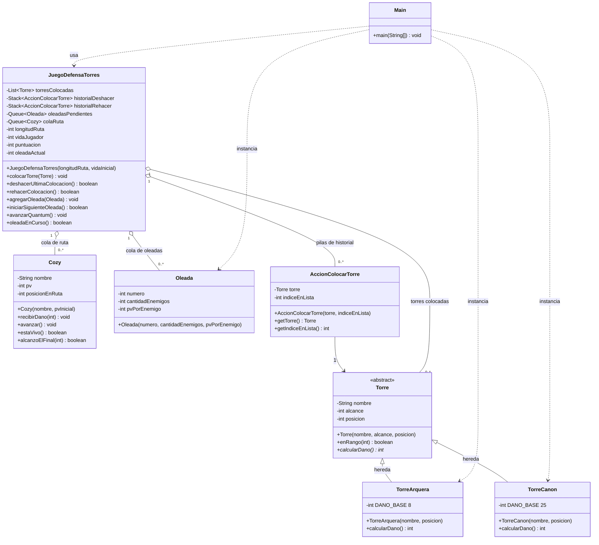

# Diagrama de clases - TDA Defensa de Torres

El TDA `JuegoDefensaTorres` administra las torres colocadas, dos pilas de
historial (deshacer/rehacer), una cola de oleadas y una cola circular de
`Cozy` en la ruta. `Torre` es abstracta: las hijas (`TorreArquera` y
`TorreCanon`) definen el dano. `Main` instancia el escenario de prueba.

Vista grafica: `diagramas/diagrama-clases.png`.

## Lectura del diagrama

| Relacion | Que representa |
|---|---|
| `Torre <|-- TorreArquera` y `Torre <|-- TorreCanon` | **Herencia.** Las hijas reutilizan nombre, alcance y posicion. |
| `calcularDano()` abstracto en `Torre` | **Polimorfismo.** Cada hija lo sobrescribe (`@Override` / `override`). |
| `JuegoDefensaTorres o-- Torre` | Lista secuencial de torres colocadas. |
| `JuegoDefensaTorres o-- Cozy` | **Cola** circular de enemigos en la ruta. |
| `JuegoDefensaTorres o-- Oleada` | **Cola** FIFO de oleadas pendientes. |
| `JuegoDefensaTorres o-- AccionColocarTorre` | **Pilas** de deshacer y rehacer. |
| `AccionColocarTorre --> Torre` | Cada accion recuerda la torre colocada y su indice. |
| `Main ..> TorreArquera` y `Main ..> TorreCanon` | **Instanciacion.** El escenario de prueba hace `new` de cada tipo. |

## Responsabilidades

| Clase | Paquete / carpeta | Responsabilidad |
|---|---|---|
| `Cozy` | `modelo` | Enemigo: PV, avance por la ruta y retiro al morir o al llegar al final. |
| `Torre` | `modelo` | Clase abstracta con alcance, posicion y dano. |
| `TorreArquera` | `modelo` | Torre de largo alcance (4) y dano 8. |
| `TorreCanon` | `modelo` | Torre de corto alcance (1) y dano 25. |
| `Oleada` | `modelo` | Datos de una oleada (cantidad y PV). |
| `AccionColocarTorre` | `modelo` | Registro de una colocacion para deshacer/rehacer. |
| `JuegoDefensaTorres` | `negocio` | TDA: pilas, colas y simulacion por quanta. |
| `Main` | `app` | Demo de consola: coloca, deshace, rehace y corre oleadas. |
