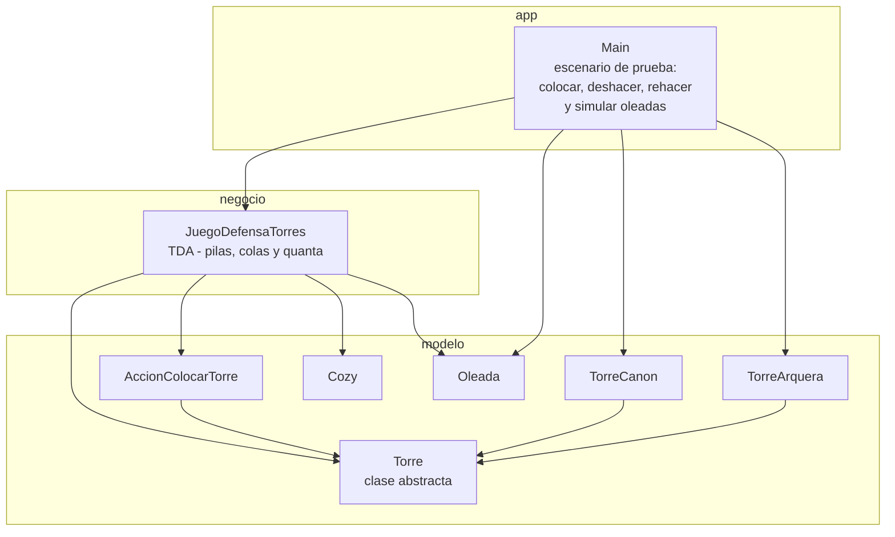
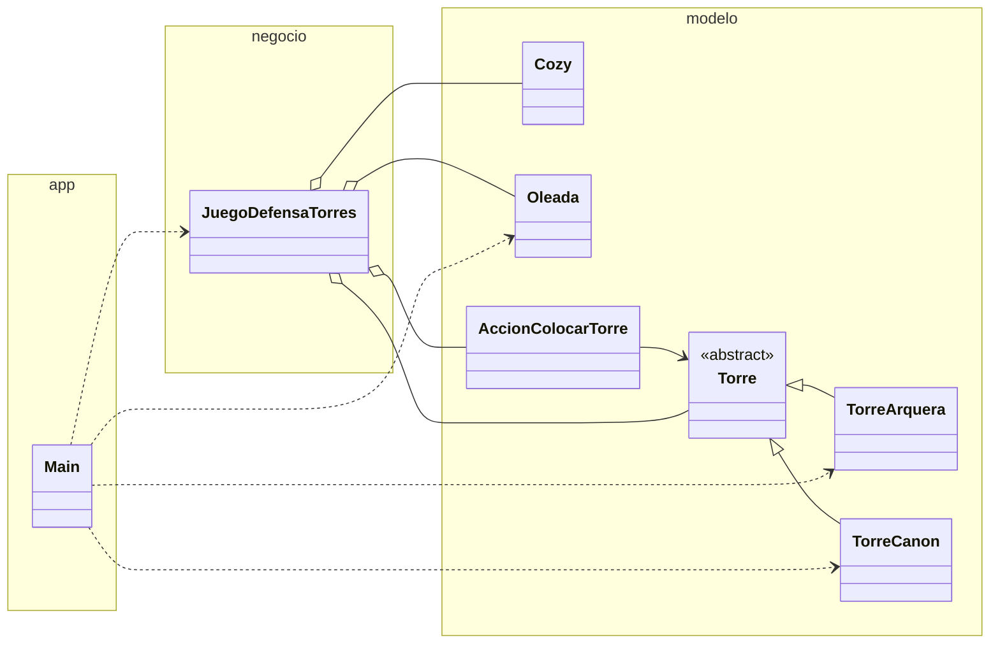

# Diagrama de paquetes - TDA Defensa de Torres

Arquitectura en tres capas, igual en Java (`Java/src/`) y en C++ (`CPP/`).
En Java los paquetes se llaman `modelo`, `negocio` y `app`.

## Dependencias entre carpetas

| Capa | Contiene | Depende de |
|---|---|---|
| `modelo/` | `Cozy`, `Torre`, `TorreArquera`, `TorreCanon`, `Oleada`, `AccionColocarTorre` | nada |
| `negocio/` | `JuegoDefensaTorres` | `modelo` |
| `app/` | `Main` | `modelo` y `negocio` |

`negocio` trabaja con el tipo `Torre`. El tipo concreto (`TorreArquera` o
`TorreCanon`) lo decide `Main` al instanciar, y el TDA lo trata de forma
polimorfica. La cola de ruta trabaja con `Cozy`; las pilas, con
`AccionColocarTorre`.
